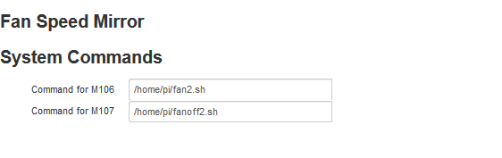

# OctoPrint-FanSpeedMirror

Mirror the parameter(s) of GCode commands M106, M107 to scripts on the OctoPrint host

## Setup

Install via the bundled [Plugin Manager](https://github.com/foosel/OctoPrint/wiki/Plugin:-Plugin-Manager)
or manually using this URL:

    https://github.com/b-morgan/OctoPrint-FanSpeedMirror/archive/master.zip

## Configuration

* Enter a command that will be sent to the OctoPrint host when an M106 is seen in the GCode. The value of the M106 S parameter will be appended to this command

* Enter a command that will be sent to the OctoPrint host when an M107 is seen in the GCode

